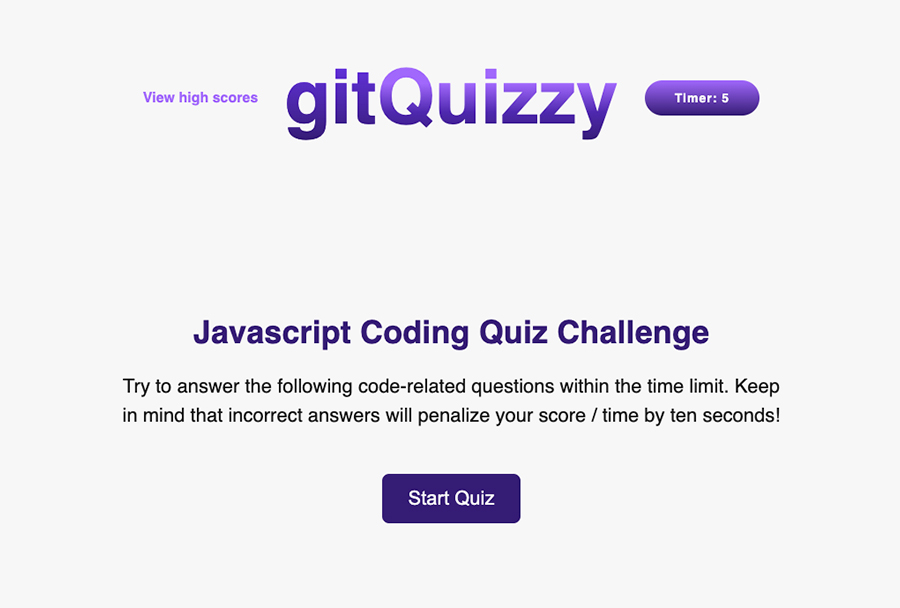

# gitQuizzy
## A fun JavaScript coding quiz game! Let's gitQuizzy!

## Purpose:
Test your knowledge of JavaScript by playing this short quiz game. Try not to get a WRONG ANSWER alert!
Good luck!

 

     

 

## Viewable Responsive Screen Sizes:
* Desktop: 1400px
* Media Query Sizes:
  - 690px (Tablets)
  - 500px (Small devices - large cell phones)

## Website Link:
https://dronetdevdesign.github.io/git-quizzy/

## This Website Created Using:
* Javascript
* HTML
* CSS

## Contribution:
Ron Dronet - Full-stack Developer and Graphic Designer